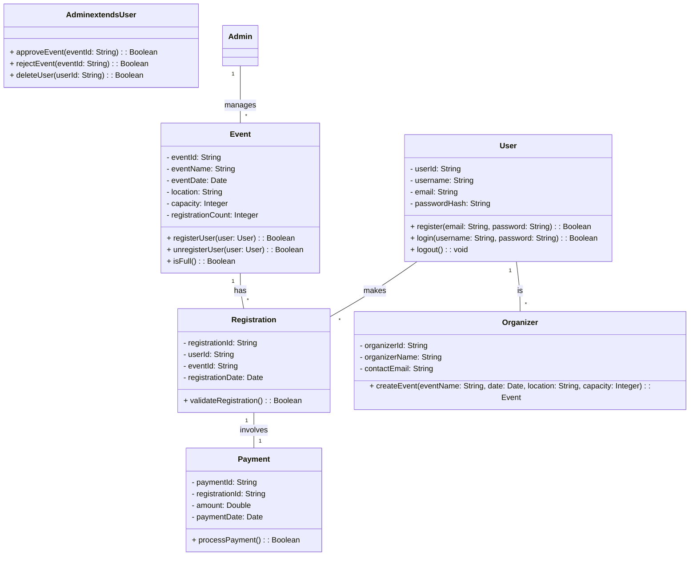

Certainly! Below is a class diagram for an Event Registration Portal using Mermaid syntax. The diagram includes main classes, properties, methods, and relationships such as inheritance and associations.

### Explanation:

- **User**: 
  - Properties: `userId`, `username`, `email`, `passwordHash`
  - Methods: `register()`, `login()`, `logout()`

- **Admin**:
  - Inherits from `User`
  - Additional methods: `approveEvent()`, `rejectEvent()`, `deleteUser()`

- **Event**:
  - Properties: `eventId`, `eventName`, `eventDate`, `location`, `capacity`, `registrationCount`
  - Methods: `registerUser()`, `unregisterUser()`, `isFull()`

- **Registration**:
  - Properties: `registrationId`, `userId`, `eventId`, `registrationDate`
  - Method: `validateRegistration()`

- **Payment**:
  - Properties: `paymentId`, `registrationId`, `amount`, `paymentDate`
  - Method: `processPayment()`

- **Organizer**:
  - Properties: `organizerId`, `organizerName`, `contactEmail`
  - Method: `createEvent()`

### Relationships:
- A user can make multiple registrations (`User "1" -- "*" Registration`)
- An admin manages multiple events (`Admin "1" -- "*" Event`)
- An event has multiple registrations (`Event "1" -- "*" Registration`)
- A registration involves one payment (`Registration "1" -- "1" Payment`)
- A user is associated with one organizer (`User "1" -- "*" Organizer`)

This diagram provides a comprehensive view of the entities and their interactions within an Event Registration Portal.